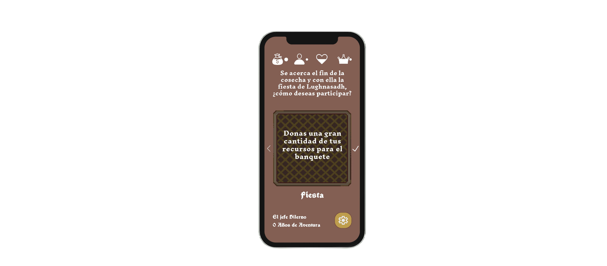
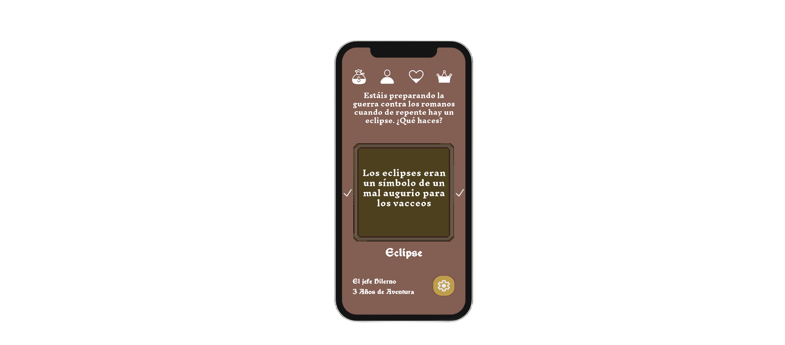

# 👑 Pintia: Forjando el Destino

Juego de rol y cartas para móviles en el que te metes en la piel de un habitante de la antigua **ciudad Vaccea de Pintia**.
Tendrás que ir tomando decisiones que afectarán a tus atributos para avanzar en tu historia.

## ❓ About

Este repositorio contiene el trabajo global de la asignatura de Sistemas Móviles, de 4º Curso del Grado de Ingeniería Informática de la Universidad de Valladolid.

El proyecto nace de una propuesta de colaboración entre el [yacimiento Vacceo "Pintia"](https://www.pintiavaccea.es/seccion/inicio) y la Universidade de Valladolid.

## 🎮 Características 

- Sistema de toma de decisiones binarias.
- Gestion de recursos.
- Múltiples Historias para jugar.
- Narrativa dinámica que cambia según las decisiones del jugador.
- Sistema de progresión y desbloqueo de niveles.

## 📸 Capturas de pantalla

